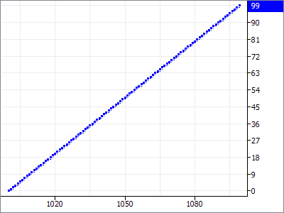
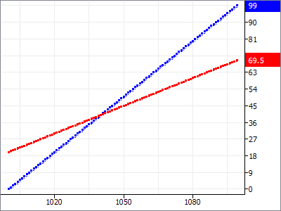
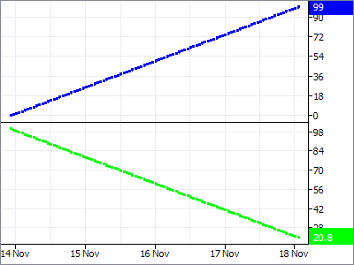

# Graph Qt Widget Library

Qt5-based graphing widget library for displaying time-series data with interactive panning, zooming, and cursors.

## Screenshots





## Prerequisites

- CMake 3.26+
- Visual Studio 2022 or later
- Ninja (for Ninja presets)
- Qt 5.15.x (msvc2019 for x86, msvc2019_64 for x64)
- vcpkg (dependencies listed in `vcpkg.json`)

## Build

1. Copy `CMakeUserPresets.json.example` to `CMakeUserPresets.json` and update the paths for your system:
   - `CMAKE_TOOLCHAIN_FILE` - path to vcpkg toolchain
   - `CMAKE_PREFIX_PATH` - path to Qt installation
   - `CMAKE_MAKE_PROGRAM` - path to Ninja (for Ninja presets)

### Visual Studio Generator

```batch
cmake --preset windows-x86-debug
cmake --build --preset windows-x86-debug
ctest --preset windows-x86-debug
```

### Ninja Multi-Config (faster builds)

Ninja builds require running from a Visual Studio Developer Command Prompt or PowerShell with the VS environment loaded.

**From VS Developer PowerShell:**

```powershell
# x86 build
Import-Module "C:\Program Files\Microsoft Visual Studio\18\Community\Common7\Tools\Microsoft.VisualStudio.DevShell.dll"
Enter-VsDevShell -VsInstallPath "C:\Program Files\Microsoft Visual Studio\18\Community" -Arch x86
cmake --preset ninja-x86
cmake --build --preset ninja-x86-debug
ctest --preset ninja-x86-debug

# x64 build
Enter-VsDevShell -VsInstallPath "C:\Program Files\Microsoft Visual Studio\18\Community" -Arch amd64
cmake --preset ninja-x64
cmake --build --preset ninja-x64-debug
ctest --preset ninja-x64-debug
```

**Available Ninja presets:**

| Configure | Build | Test |
|-----------|-------|------|
| `ninja-x86` | `ninja-x86-debug`, `ninja-x86-release` | `ninja-x86-debug`, `ninja-x86-release` |
| `ninja-x64` | `ninja-x64-debug`, `ninja-x64-release` | `ninja-x64-debug`, `ninja-x64-release` |

## Static Analysis (clang-tidy)

The project includes a `.clang-tidy` configuration for static analysis. Use the clang-tidy bundled with Visual Studio.

### Running clang-tidy

Run clang-tidy on source files using the VS bundled LLVM (adjust edition: Community/Professional/Enterprise):

```batch
"C:\Program Files\Microsoft Visual Studio\18\Community\VC\Tools\Llvm\bin\clang-tidy.exe" ^
  -p build-windows graph_line.cpp
```

The CI lint job runs clang-tidy automatically on Ubuntu.

## Outputs

- `graph_qt` - Static library
- `graph_qt_tester` - Demo application

## Updating Golden Screenshots

The rendering tests compare widget output against golden images stored in `testdata/`. To update golden screenshots after intentional visual changes:

1. Delete the outdated golden image(s) from `testdata/`
2. Run the tests - new golden images will be generated automatically
3. Verify the new images look correct
4. Commit the updated golden images

When a rendering test fails, it saves the actual output as `testdata/actual_*.png` for comparison.
