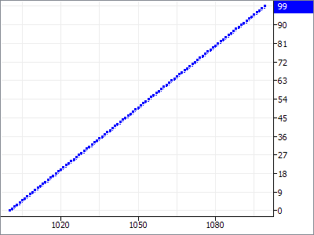
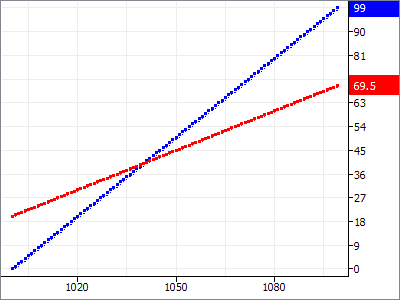
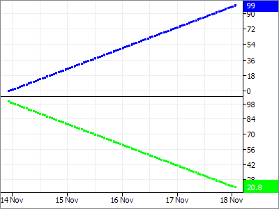

# Graph Qt Widget Library

Qt6-based graphing widget library for displaying time-series data with interactive panning, zooming, and cursors.

## Screenshots





## Prerequisites

- CMake 3.26+
- Visual Studio 2022 or later
- Ninja (for Ninja presets)
- Qt 6 with the Widgets module. `CMakeLists.txt` asks only for
  `find_package(Qt6 COMPONENTS Widgets)` — no minimum minor is enforced, and
  the version in use depends on where Qt comes from:
  - vcpkg `qtbase` (see `vcpkg.json`); the committed `builtin-baseline`
    resolves to 6.9.1, and Windows builds use the msvc x86/x64 triplets
  - Homebrew `qt` (6.11.1 as of this writing) when the `scada` superproject
    builds this repo on macOS via its `macos-local-client` preset
- vcpkg (dependencies listed in `vcpkg.json`)

## Build

`CMakePresets.json` ships only generator-level presets (`ninja-x86`,
`ninja-x64`); machine-specific paths live in your own `CMakeUserPresets.json`,
which is gitignored.

1. Copy `CMakeUserPresets.json.example` to `CMakeUserPresets.json`. It defines
   `-local` variants of the shipped presets — update the placeholder paths:
   - `CMAKE_TOOLCHAIN_FILE` - path to the vcpkg toolchain
     (`<vcpkg>/scripts/buildsystems/vcpkg.cmake`)
   - `CMAKE_MAKE_PROGRAM` - path to `ninja.exe`; drop this entry if Ninja is
     already on `PATH`

   Qt needs no path here: with the vcpkg toolchain, manifest mode builds the
   `qtbase` dependency from `vcpkg.json` into the build tree. Only add
   `CMAKE_PREFIX_PATH` if you want to point at an existing Qt 6 installation
   instead — and note that the official Qt 6 installer ships no 32-bit MSVC
   kit, so the x86 preset must use vcpkg.

2. Build from a Visual Studio Developer Command Prompt, or PowerShell with the
   VS environment loaded — the Ninja generator needs `cl.exe` on `PATH`.

**From VS Developer PowerShell:**

```powershell
# x86 build
Import-Module "C:\Program Files\Microsoft Visual Studio\18\Community\Common7\Tools\Microsoft.VisualStudio.DevShell.dll"
Enter-VsDevShell -VsInstallPath "C:\Program Files\Microsoft Visual Studio\18\Community" -Arch x86
cmake --preset ninja-x86-local
cmake --build --preset ninja-x86-local-debug
ctest --preset ninja-x86-local-debug

# x64 build
Enter-VsDevShell -VsInstallPath "C:\Program Files\Microsoft Visual Studio\18\Community" -Arch amd64
cmake --preset ninja-x64-local
cmake --build --preset ninja-x64-local-debug
ctest --preset ninja-x64-local-debug
```

**Presets from `CMakeUserPresets.json.example`** (each inherits the shipped
`ninja-x86` / `ninja-x64` configure preset and its `build-ninja-x86` /
`build-ninja-x64` binary directory):

| Configure | Build | Test |
|-----------|-------|------|
| `ninja-x86-local` | `ninja-x86-local-debug`, `ninja-x86-local-release` | `ninja-x86-local-debug`, `ninja-x86-local-release` |
| `ninja-x64-local` | `ninja-x64-local-debug`, `ninja-x64-local-release` | `ninja-x64-local-debug`, `ninja-x64-local-release` |

The shipped `ninja-x86` / `ninja-x64` presets can also be used directly if you
pass the local paths on the command line instead:

```powershell
cmake --preset ninja-x86 `
  -DCMAKE_TOOLCHAIN_FILE="$env:VCPKG_ROOT/scripts/buildsystems/vcpkg.cmake" `
  -DVCPKG_TARGET_TRIPLET=x86-windows
```

## Static Analysis (clang-tidy)

The project includes a `.clang-tidy` configuration for static analysis. Use the clang-tidy bundled with Visual Studio.

### Running clang-tidy

Run clang-tidy on source files using the VS bundled LLVM (adjust edition: Community/Professional/Enterprise):

```batch
"C:\Program Files\Microsoft Visual Studio\18\Community\VC\Tools\Llvm\bin\clang-tidy.exe" ^
  -p build-ninja-x86 graph_line.cpp
```

## Outputs

- `graph_qt` - Static library
- `graph_qt_tester` - Demo application

## Updating Golden Screenshots

The rendering tests compare widget output against golden images stored in `testdata/`. To update golden screenshots after intentional visual changes:

1. Delete the outdated golden image(s) from `testdata/`
2. Run the tests - new golden images will be generated automatically
3. Verify the new images look correct
4. Commit the updated golden images

When a rendering test fails, it saves the actual output as `testdata/actual_*.png` for comparison.
